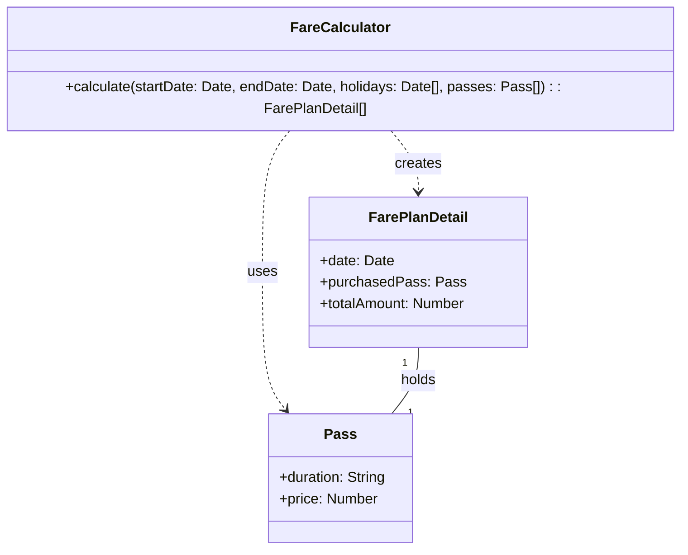

```mermaid
classDiagram
    class Pass {
        +duration: String
        +price: Number
    }

    class FareCalculator {
        +calculate(startDate: Date, endDate: Date, holidays: Date[], passes: Pass[]): FarePlanDetail[]
    }

    class FarePlanDetail {
        +date: Date
        +purchasedPass: Pass
        +totalAmount: Number
    }

    FareCalculator ..> Pass : uses
    FareCalculator ..> FarePlanDetail : creates
    FarePlanDetail "1" -- "1" Pass : holds
```
